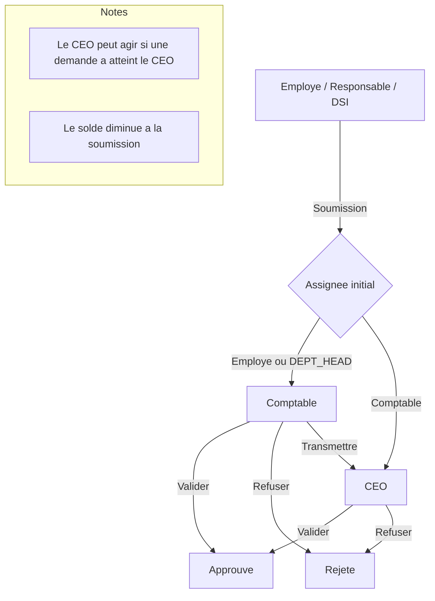

# CONGES

Application de gestion des conges (Next.js + Prisma + MongoDB) avec roles (CEO, Comptable, Responsable, Employe), workflows de validation et tableaux de bord.

## Fonctionnalites principales
- Authentification par email ou matricule
- Workflow des demandes de conge (soumission, validation, refus, transmission)
- Dashboards par role (Employe, Responsable, DSI, Comptable, CEO)
- Solde annuel de conges (base par defaut 25 jours, ajustable par le CEO)
- Historique des demandes et decisions

## Stack
- Next.js (App Router)
- React 19
- Prisma + MongoDB
- Tailwind CSS
- react-hot-toast

## Installation
```bash
npm install
```

## Configuration
Creer un fichier `.env` a la racine et definir :
```
DATABASE_URL=
JWT_SECRET=
DEPT_HEAD_VALIDATION_DAYS=5

# (Optionnel) comptes seed
SEED_ADMIN_EMAIL=admin.dsi@local.test
SEED_ADMIN_MATRICULE=DSI-ADMIN
SEED_ADMIN_PASSWORD=Passw0rd!
SEED_ACCOUNTANT_EMAIL=comptable@local.test
SEED_ACCOUNTANT_MATRICULE=ACC-001
SEED_ACCOUNTANT_PASSWORD=Passw0rd!
SEED_CEO_EMAIL=pdg@local.test
SEED_CEO_MATRICULE=CEO-001
SEED_CEO_PASSWORD=Passw0rd!
SEED_OPS_DIRECTOR_EMAIL=directeur.ops@local.test
SEED_OPS_DIRECTOR_MATRICULE=OPS-DIR-001
SEED_OPS_DIRECTOR_PASSWORD=Passw0rd!
```

## Prisma
Appliquer le schema et regenerer le client :
```bash
npx prisma db push
npx prisma generate
```

## Seed (comptes de demarrage)
```bash
npm run seed
```

Comptes par defaut (si les variables SEED_* ne sont pas redefinies) :
- Admin DSI (DEPT_HEAD) : admin.dsi@local.test / Passw0rd!
- Comptable (ACCOUNTANT) : comptable@local.test / Passw0rd!
- CEO : pdg@local.test / Passw0rd!
- Directeur Operations (DEPT_HEAD) : directeur.ops@local.test / Passw0rd!

## Lancer le projet
```bash
npm run dev
```
Puis ouvrir http://localhost:3000

## Notes importantes
- Le solde annuel par defaut est 25 jours.
- Le CEO peut augmenter ou reinitialiser le solde d'un employe.
- Le solde visible par l'employe = base annuelle - jours consommes (soumis + en attente + approuves).
- Les demandes sont assignees automatiquement selon le role de l'employe.

## Workflow (diagramme)


## Scripts utiles
- `npm run dev` : serveur de dev
- `npm run build` : build
- `npm run start` : production
- `npm run lint` : lint
- `npm run seed` : seed base
